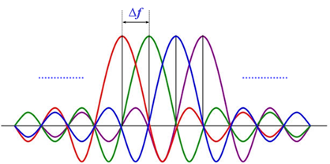
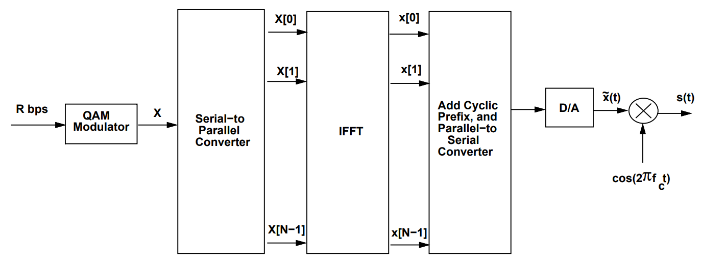

We first motivate the use of OFDM by a discussion on inter-symbol interference in frequency-selective fading channels and how multi-carrier modulation can be used to overcome it.

## Background
As the bandwidth of the signal used for communication increases, it becomes impractical to assume that the channel has a constant (flat) frequency response for the entire bandwidth of the signal. We will therefore have to account for the frequency-selective nature of the channel (i.e multi-tap delay fading channel). One of the major consequences of this multi-tap delay channel is intersymbol interference (ISI), caused by distortion (spreading) of the transmitted pulses.

Multicarrier modulation is one method of mitigating ISI. In this scheme, the channel is divided into multiple subcarriers which individually can be modulated using independent parallel data streams. Each modulated subcarrier occupies the frequency band $B_N = \frac{1}{T}$ where $T$ is the duration of each data stream. The channel fading effect on each subcarrier can be assumed to be flat. Multicarrier modulated signal can be written as

$$
s(t) = \sum_{i=0}^{N-1} s_i g(t) \cos(2\pi f_i t + \phi_i)
$$

where $s_i$ is the symbol corresponding to $i$-th stream, $g(t)$ is the pulse shaping waveform of duration $T$ and it has a bandwidth $B_N$. The $i$-th carrier frequency is given by $f_i=f_0+(i-1)\Delta f, ~ i=1,\dots,N$. 

 

The minimum possible $\Delta f$ such that the modulated subcarrier remains orthogonal is $B_N$. Therefore, the total bandwidth of the transmitted signal becomes $B=NB_N$. Utilizing the orthogonality of the subcarriers, the data stream can be demodulated independently, which in turn helps in removing the ISI. Note that this ISI removal is attributed to the fact that symbol duration over each sub-carrier $T$ becomes significantly larger than the delay spread. 

How exactly this scheme leads to ISI mitigation will be explained in the section on the OFDM transmitter. Now we are ready to talk about how OFDM is implemented as a form of multicarrier modulation.

## OFDM scheme

In the following, we describe the baseband implementation of transmitter and reciever of OFDM.

## Transmitter

The OFDM transmitter schematic is as shown below. Details of each block have been explained in the forthcoming sections. 

 

### 1. Symbol mapping

We start with a data stream that is encoded using a **QAM constellation**, resulting in a complex symbol stream. This set of symbols needs to be sent across the $N$ sub-carriers. We denote this sequence by:

$$X=[X[0], X[1], \dots, X[N-1]]$$

These are effectively the discrete frequency components of the modulator output.

### 2. Series-to-Parallel and IFFT

The above sequence of symbols are passed through:

- **series-to-parallel converter** : The symbols are placed in different subcarriers (parallel) instead of different slots within a single coherence time. Hence, each symbol occupies the symbol time $T$, but in its respective frequency band. Since the symbols are better spaced in time, ISI is mitigated.

- **N-point IFFT** : It is applied to convert the frequency domain sequence $X$ into time-domain sequennce $x$ as given below

$$
\begin{aligned}
    x[n] = \frac{1}{\sqrt{N}} \sum_{i=0}^{N-1} X[i] e^{j \frac{2\pi n}{N} i}, \quad 0 \leq n \leq N-1
\end{aligned}
$$

### 3. Parallel-to-Series and Cyclic Prefix

- The time-domain sequence $x$ is **converted back to serial form**
- A **cyclic prefix** (CP) of length \( \mu \) is added to sequence $X$. The CP added sequence is given by

$$\tilde{X}=[ X[N-\mu-1], \dots, X[N-1], X[0], X[1], \dots, X[N-1]]$$

### 3. Digital-to-Analog and RF Modulation

- The resulting signal is **converted to analog (D/A)**
- Modulated using a carrier frequency $f_c$

## Channel

- The transmitted signal $\tilde{X}$ is **distorted by the channel** (modeled as a FIR filter $h[n]$ of length $\mu$ and **corrupted by noise** $\nu[n]$.
- The received analog signal r(t) is **down-converted** to baseband. The sampled baseband signal is given by

$$
\begin{aligned}
    y[n] = \tilde{x}[n] * h[n] + \nu[n], \quad -\mu \leq n \leq N-1
\end{aligned}
$$

It is to be noted that the **cyclic prefix** is added to convert the above **linear convolution** into a **circular convolution**. Thus, we have

$$
\begin{aligned}
    y[n] = h[n] \circledast x[n] + + \nu[n], \quad 0 \leq n \leq N-1
\end{aligned}
$$

Note that the above expression is applicable afer the removal of CP.

## Receiver

The OFDM receiver schematic is as shown below. Details of each block have been explained in the forthcoming sections. 

### 1. Cyclic Prefix Removal and FFT

- Removal of **cyclic prefix** : The first $\mu$ samples are **removed** from the sequnce $y[n]$.
- The remaining sequence $y$ of length $N$ is **converted to parallel form** and passed through an **FFT block**. Utilizing the property of FFT of circular convolution, the FFT of the sequence $y[n]$ becomes

$$
\begin{aligned}
    Y[i] = H[i] X[i] + \tilde{\nu}[i]
\end{aligned}
$$

where $H[i]$ is the channel response (flat-fading channel) of the $i$-th subcarrier and $\tilde{\nu}[i]$ is the noise in frequency domain. It can be observed that the symbol loaded on the $i$-th subcarrier can be recovered using single tap frequency equalizer as below

$$
\begin{equation}
   \hat{X}[i] = \frac{Y[i]}{H[i]}
\end{equation}
$$

and this estimated sequence can be further decoded to recover the transmitted bit stream.

### 2. QAM Demodulation

- The estimated sequnce $\hat{X}$ is **converted to serial** and **QAM demodulation** of each symbol can be performed to recover the original data.

> *Further mathematical details have been omitted.*
