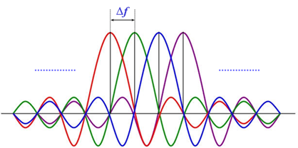
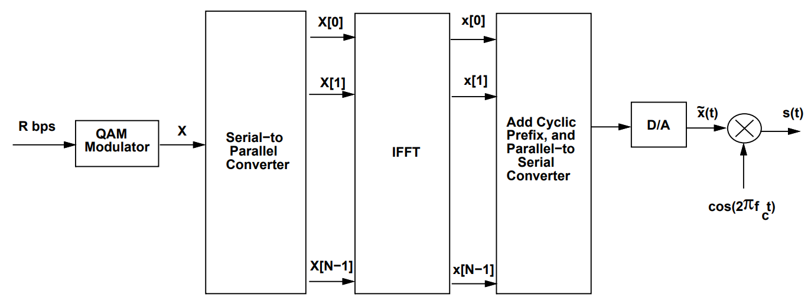

We first motivate the use of OFDM by a discussion on inter-symbol interference in frequency-selective fading channels and how multi-carrier modulation can be used to overcome it.

---

## Background

As the bandwidth of the signal used for communication increases, it becomes impractical to assume that the channel has a constant (flat) frequency response for the entire bandwidth of the signal. We will therefore have to account for the frequency-selective nature of the channel (i.e multi-tap delay fading channel). One of the major consequences of this multi-tap delay channel is intersymbol interference (ISI), caused by distortion (spreading) of the transmitted pulses.

In practical wireless systems, such as broadband mobile communication and wireless local area networks, delay spread caused by multipath propagation results in overlapping of adjacent symbols. When the delay spread becomes comparable to or larger than the symbol duration, severe ISI occurs, significantly degrading detection performance.

Multicarrier modulation is one method of mitigating ISI. In this scheme, the channel is divided into multiple subcarriers which individually can be modulated using independent parallel data streams. Each modulated subcarrier occupies the frequency band $B_N = \frac{1}{T}$ where $T$ is the duration of each data stream. The channel fading effect on each subcarrier can be assumed to be flat. Multicarrier modulated signal can be written as

$$
s(t) = \sum_{i=0}^{N-1} s_i g(t) \cos(2\pi f_i t + \phi_i)
$$

where $s_i$ is the symbol corresponding to $i$-th stream, $g(t)$ is the pulse shaping waveform of duration $T$ and it has a bandwidth $B_N$. The $i$-th carrier frequency is given by $f_i=f_0+(i-1)\Delta f, ~ i=1,\dots,N$. 

 

---

## Orthogonality of Subcarriers

The minimum possible $\Delta f$ such that adjacent subcarriers remain orthogonal is

$$
\Delta f = \frac{1}{T}.
$$

Two subcarriers $e^{j2\pi f_k t}$ and $e^{j2\pi f_l t}$ are orthogonal over duration $T$ if

$$
\int_0^T e^{j2\pi (f_k - f_l)t} dt = 0, \quad k \neq l.
$$

When $\Delta f = 1/T$, the above condition is satisfied, ensuring that even though subcarriers overlap in frequency, they do not interfere with each other after demodulation.

The total bandwidth of the transmitted signal becomes $B=NB_N$. Utilizing the orthogonality of the subcarriers, the data stream can be demodulated independently, which in turn helps in removing the ISI. Note that this ISI removal is attributed to the fact that symbol duration over each sub-carrier $T$ becomes significantly larger than the delay spread. 

Thus, by increasing symbol duration on each subcarrier, the channel appears approximately flat for each narrowband component. This converts a frequency-selective channel into multiple parallel flat-fading channels.

---

## OFDM in Real-Life Applications

OFDM is widely used in modern communication systems due to its robustness against ISI and spectral efficiency. Some important real-world applications include:

- 4G LTE and 5G NR mobile communication  
- Wi-Fi (IEEE 802.11 standards)  
- Digital Video Broadcasting (DVB)  
- WiMAX broadband systems  

Its ability to handle multipath fading efficiently and allow simple frequency-domain equalization makes OFDM highly suitable for high-data-rate broadband communication systems.

---

## OFDM Scheme

In the following, we describe the baseband implementation of transmitter and receiver of OFDM.

---

# Transmitter

The OFDM transmitter schematic is as shown below.

 

---

### 1. Symbol Mapping

We start with a data stream that is encoded using a **QAM constellation**, resulting in a complex symbol stream. This set of symbols needs to be sent across the $N$ sub-carriers. We denote this sequence by:

$$
X=[X[0], X[1], \dots, X[N-1]]
$$

These are effectively the discrete frequency components of the modulator output.

---

### 2. Series-to-Parallel and IFFT

- **Series-to-parallel conversion**: Symbols are distributed across subcarriers.
- **N-point IFFT**: Converts frequency-domain symbols to time-domain samples.

$$
x[n] = \frac{1}{\sqrt{N}} \sum_{i=0}^{N-1} X[i] e^{j \frac{2\pi n}{N} i}, \quad 0 \leq n \leq N-1
$$

The IFFT efficiently generates orthogonal subcarriers digitally. It ensures that each OFDM symbol consists of a sum of orthogonal complex exponentials.

---

### 3. Cyclic Prefix (CP)

- Time-domain sequence is converted to serial.
- A cyclic prefix of length $\mu$ is added:

$$
\tilde{x} = [x[N-\mu], \dots, x[N-1], x[0], \dots, x[N-1]]
$$

The cyclic prefix must satisfy $\mu \geq L-1$, where $L$ is channel length. This ensures that linear convolution becomes circular convolution.

---

# Channel

The transmitted signal is distorted by an FIR channel $h[n]$ and corrupted by noise $\nu[n]$:

$$
y[n] = \tilde{x}[n] * h[n] + \nu[n]
$$

After CP removal:

$$
y[n] = h[n] \circledast x[n] + \nu[n], \quad 0 \leq n \leq N-1
$$

Due to circular convolution, the FFT diagonalizes the channel, converting convolution into multiplication in frequency domain.

---

# Receiver

The OFDM receiver schematic is shown below.

---

### 1. CP Removal and FFT

$$
Y[i] = H[i] X[i] + \tilde{\nu}[i]
$$

where $H[i]$ is the flat-fading response of the $i$-th subcarrier.

---

## Equalization in OFDM

Since each subcarrier experiences flat fading, equalization reduces to a simple one-tap frequency-domain equalizer.

### ZF Equalizer:
$$
\hat{X}[i] = \frac{Y[i]}{H[i]}
$$

However, if $H[i]$ is small, noise amplification occurs.

### MMSE Equalizer:

To reduce noise amplification, the MMSE equalizer is used:

$$
\hat{X}[i] = \frac{H^*[i]}{|H[i]|^2 + \sigma_n^2} Y[i]
$$

Thus, OFDM converts a complex time-domain equalization problem into simple per-subcarrier equalization.

---

### 2. QAM Demodulation

- Estimated sequence $\hat{X}$ is converted to serial.
- QAM demodulation is performed to recover original data.

---

## Summary

OFDM mitigates ISI by:
1. Increasing symbol duration per subcarrier  
2. Adding cyclic prefix to remove inter-block interference  
3. Converting linear convolution into circular convolution  
4. Enabling simple one-tap frequency-domain equalization  

These properties make OFDM highly efficient and widely adopted in modern broadband wireless communication systems.

